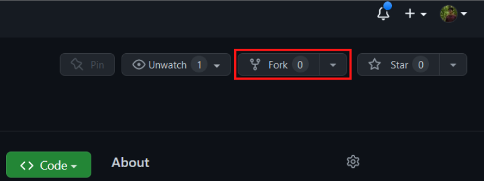
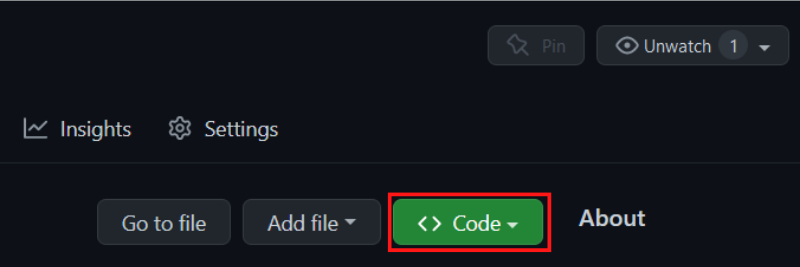
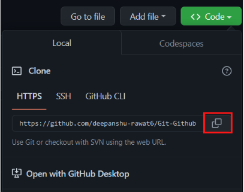

# Git-Github-Tutorial

This readme aims to simplify and guide the way beginners make their first contribution. If you are looking to make your first contribution, follow the steps below.
 


#### If you don't have git on your machine, [install it](https://docs.github.com/en/get-started/quickstart/set-up-git).

## Fork this repository

Fork this repository by clicking on the fork button on the top of this page.
This will create a copy of this repository in your account.

## Clone the repository



Now clone the forked repository to your laptop. Go to your GitHub account, open the forked repository, click on the code button and then click the _copy to clipboard_ icon.

Open your git bash and run the following git command:

```
git clone "url you just copied"
```

where "url you just copied" (without the quotation marks) is the url to this repository (your fork of this project). See the previous steps to obtain the url.



For example:

```
git clone https://github.com/<user_name>/<repository_link>.git
```

where `<user_name>` is your GitHub username. Here you're copying the contents of the `Git-Github-Tutorial` repository on GitHub to your laptop.

## Create a branch

Change to the repository directory on your machine(if you are not already there):

```
cd Git-Github-Tutorial
```

Now create a branch using the `git branch` command:

```
git branch <branch_name>
```

For example:

```
git branch feature
```

To switch to new branch use the command `git checkout` command:

```
git checkout <branch_name>
```

For example:

```
git checkout feature
```

## Make necessary changes and commit those changes

Now changes directory to the `Data` folder.

```
cd Data
```

Now create a text file using the `touch` command:

```
touch <file_name>.txt
```

For example:

```
touch Deepanshu.txt
```

Now open the newly created text file in a `text editor` or `VS Code`, enter your information. After final edit save the file. 


If you go to the project directory and execute the command `git status`, you'll see there are changes.

Add those changes to the branch you just created using the `git add` command:

```
git add Contributors.md
```
Now commit those changes using the `git commit` command:

```
git commit -m "Add your-name to Contributors list"
```

replacing `your-name` with your name.

## Push changes to GitHub

Push your changes using the command `git push`:

```
git push -u origin your-branch-name
```

replacing `your-branch-name` with the name of the branch you created earlier.

<details>
<summary> <strong>If you get any errors while pushing, click here:</strong> </summary>

- ### Authentication Error
     <pre>remote: Support for password authentication was removed on August 13, 2021. Please use a personal access token instead.
  remote: Please see https://github.blog/2020-12-15-token-authentication-requirements-for-git-operations/ for more information.
  fatal: Authentication failed for 'https://github.com/<your-username>/first-contributions.git/'</pre>
  Go to [GitHub's tutorial](https://docs.github.com/en/authentication/connecting-to-github-with-ssh/adding-a-new-ssh-key-to-your-github-account) on generating and configuring an SSH key to your account.

</details>

## Submit your changes for review

If you go to your repository on GitHub, you'll see a `Compare & pull request` button. Click on that button.


Now submit the pull request.


Soon I'll be merging all your changes into the main branch of this project. You will get a notification email once the changes have been merged.


